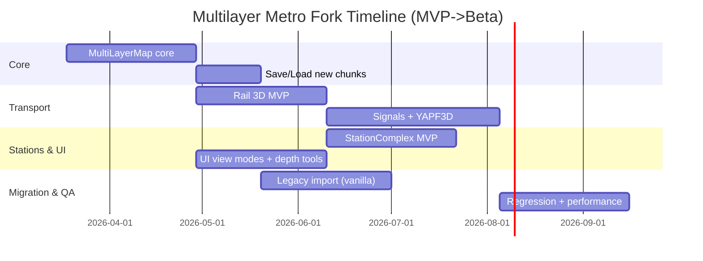

# Техническое задание для форка OpenTTD: многослойная карта с полноценным подземным метро и импортом старых сейвов

## Executive summary

Цель — реализовать в форке **настоящую многослойную карту** (несколько уровней по Z на каждом (x,y)) с полноценным подземным движением поездов (сигналы, блокировка/резервации, пересечения на разных глубинах), **многоуровневыми подземными станциями** и **выходами на поверхность**, при этом обеспечить **однонаправленный импорт** старых сейвов (старый мир ↦ новый многослойный мир). Базовая мотивация и ключевая архитектурная идея (2D массив «колонн тайлов» вместо 3D массива) прямо обсуждались в официальном обсуждении “Multi-layer map” в репозитории OpenTTD: предлагается хранить **tile columns** с «пустотами» и «плитами», чтобы не тратить память на воздух/грунт, и подчёркивается, что совместимость со старыми сейвами достижима через конвертацию. citeturn1view1

Ключевое решение ТЗ: **не расширять существующие «wormhole»-тоннели**, а заменить модель карты и инфраструктуры так, чтобы подземные пути и станции были **реальными тайлами/слайсами** в колонне, с полноценными правилами соседства, сигнализации и отрисовки. Ограничения текущих тоннелей (невозможность ставить сигналы, ограничение фактически на один поезд, невозможность пересечений без читов) документированы в руководстве. citeturn1view2turn32search11

Совместимость по сейвам формулируется как:  
*«Новая версия может импортировать старые сейвы (один уровень), но новые сейвы не обязаны открываться в ваниле»*. Это соответствует тому, как OpenTTD в целом относится к «savegame bump» и обратной совместимости: при добавлении новых сохраняемых данных ванильные сборки должны корректно отказываться загружать «слишком новые» сейвы. citeturn1view0turn11view0

## Контекст и базовые ограничения текущего движка

Текущая реализация «подземности» в OpenTTD — это прежде всего **тоннели как специальный случай**: поезда «исчезают» на входе и «появляются» на выходе, поэтому в базовой игре **нельзя ставить сигналы внутри железнодорожных тоннелей**, и из-за этого **длинные тоннели становятся узким местом**; также тоннели **не пересекаются** (кроме читов). citeturn1view2turn32search11

Сигнализация и резервации пути (PBS / path signals) в OpenTTD — центральный механизм плотного движения; руководство подчёркивает, что **path signals позволяют резервировать и разделять секции пути**. citeturn32search2turn14search0 При этом API и реализация YAPF (pathfinder) явно завязаны на 2D `TileIndex` и «wormhole»-логику (в doxygen-ссылках фигурируют `GetOtherTunnelBridgeEnd()` и `TRACK_BIT_WORMHOLE`), что демонстрирует масштаб изменений: многослойность затронет не только хранение карты, но и маршрутизацию/резервации. citeturn15view1

Важно: даже в экосистеме форков уже есть частичное закрытие «болевых точек» (например, в entity["video_game","JGR's Patch Pack","openttd patchpack fork"] заявлены **signals in tunnels and on bridges** и дополнительные функции строительства под мостами), но это всё равно не даёт «настоящего метро» как отдельного слоя карты и не решает задачу многоуровневых станций. citeturn3view0turn32search15

Для моддинга (NewGRF/NML) уже существуют практики «визуального метро»: например, Metro Track Set добавляет railtype, включая вариант **“underground” tracks**, а AuzStations Subway Stations предлагает «overlapping station tiles» (парк/парковка сверху как маскировка станции). Это полезно как исходный UX-паттерн и для совместимости графики, но не заменяет движковую многослойность. citeturn4search0turn4search1

## Архитектура многослойной карты и транспорта

### Выбор модели данных: «колонны» и «слайсы»

Базовый подход: **2D массив колонн** `TileColumn[x,y]`, внутри каждой — упорядоченный по Z набор «слайсов» (плит/объёмов) `TileSlice`. Это соответствует мотивации из обсуждения multi-layer map: 3D массив «потратит массу памяти на воздух», поэтому предлагается 2D массив колонн, где колонна хранит только значимые участки (ground/air/объекты). citeturn1view1

При этом важно опереться на уже существующую в OpenTTD абстракцию `Tile` как «wrapper class to abstract away the way the tiles are stored» — это прямо отражено в `map_func.h` (doxygen). Идеологически это совпадает с давними планами MapRewriteDesign: не лезть напрямую в `_map` массивы и адресацию одним индексом, а пользоваться API доступа. citeturn19view0turn20view0

### Структуры и идентификаторы

**Требование ТЗ:** все игровые системы, которым раньше хватало `TileIndex`, должны получить новый «указатель на тайл в 3D» — `TileRef`, и при этом должен существовать стабильный сериализуемый идентификатор «элемента в колонне» (SliceID). В MapRewriteDesign прямо говорится, что при многослойности «нельзя адресовать тайл одним индексом», и предлагается заменить `TileIndex` на `TileRef`. citeturn20view0

Ниже — рекомендуемая (практичная) модель: глобальный пул слайсов + список SliceID в колонне (упорядочен по `z_base`).

```cpp
// Стабильный сериализуемый идентификатор слайса.
using SliceID = uint32_t;

struct TileCoord {
    uint16_t x;
    uint16_t y;
};

// Ссылка на конкретный слайс (не на колонну).
struct TileRef {
    TileCoord xy;
    SliceID   id;       // -> TileSlice в пуле
};

// Базовая геометрия: полуинтервалы [z_base; z_top)
struct ZSpan {
    int16_t z_base;
    int16_t z_top;      // z_top > z_base
};

// Типы слайсов (минимальный MVP-набор)
enum class SliceKind : uint8_t {
    Surface,        // грунт/вода/берег и т.п.
    Track,          // рельсы/стрелки/пересечения
    Signal,         // семафор/светофор привязанный к Track-слайсу
    StationTile,    // станционные тайлы (платформа/вестибюль/выход)
    BridgeDeck,     // пролет/настил
    TunnelWall,     // «оболочка» (опционально для рендера)
    Object,         // декоративные/функциональные объекты
};

struct TrackPayload {
    uint8_t  railtype;     // совместимо с текущими RailType (внутренний ID)
    uint16_t trackbits;    // аналог TrackBits, но в 3D-контексте
    // Связь с сигнализацией:
    uint32_t signal_mask;  // какие ребра/направления имеют сигнал
};

enum class StationRole : uint8_t {
    Platform,
    Concourse,
    ExitSurface,   // выход на поверхность (доступ пассажиров к catchment)
    PortalTrack,   // портальный выезд/въезд для поездов (рамп/шахта)
};

struct StationTilePayload {
    uint32_t station_id;   // логический StationComplexID/StationID
    StationRole role;
    uint16_t    local_meta; // tile_type / стилевые флаги / ориентация
};

struct SurfacePayload {
    uint8_t  ground_type;
    uint8_t  slope;
    uint8_t  height_base;  // базовая высота (совместимо с текущей логикой)
};

struct TileSlice {
    SliceID   id;
    TileCoord xy;
    ZSpan     z;
    SliceKind kind;
    uint8_t   owner;

    // «Юнион» (в C++ лучше std::variant)
    std::variant<SurfacePayload, TrackPayload, StationTilePayload> payload;
};

struct TileColumn {
    // Упорядочено по z_base
    std::vector<SliceID> slices;
};
```

### API доступа к карте

ТЗ требует чёткий слой API, чтобы минимизировать каскадные изменения и упростить тестирование/миграции. Функции должны покрывать 3 типовых сценария: *итерация*, *поиск слайса по z/типу*, *получение соседей*.

```cpp
class MultiLayerMap {
public:
    // O(1) доступ к колонне
    const TileColumn& GetColumn(TileCoord xy) const;
    TileColumn&       GetColumn(TileCoord xy);

    // Доступ к слайсу по SliceID
    const TileSlice&  GetSlice(SliceID id) const;
    TileSlice&        GetSlice(SliceID id);

    // Поиск слайса «на высоте» (например, верхний видимый в режиме)
    std::optional<SliceID> FindTopmostAt(TileCoord xy, int16_t z_query) const;

    // Итерация по всему миру
    void ForEachColumn(std::function<void(TileCoord, const TileColumn&)> fn) const;
    void ForEachSlice(std::function<void(const TileSlice&)> fn) const;

    // Билдинг: попытка вставки (с проверкой пересечений)
    std::expected<SliceID, BuildError> TryInsertSlice(const TileSlice& spec);

    // Удаление слайса и обновление индексов в колонне
    bool RemoveSlice(SliceID id);

    // Соседи для pathfinding (поезда/рельсы)
    std::vector<TileRef> EnumerateTrackNeighbors(TileRef from) const;
};
```

Обоснование необходимости «wrapper API»: MapRewriteDesign прямо предупреждает, что прямой доступ к массивам тайлов мешает менять внутреннее хранение без переписывания всего кода, и предлагает переходить на функции доступа к карте и `TileRef`. citeturn20view0turn19view0

### Модель путей, сигналов и резерваций

**Требование:** под землёй должны работать те же принципы, что и на поверхности: path signals, резервации до safe waiting position, блокировки, выбор маршрута. Концептуально safe waiting position описан в документации PBS (исторической): путь резервируется до следующей безопасной точки (сигнал/депо/конец пути), а сигналы красные, пока резервация невозможна. citeturn32search6turn32search14

В текущем YAPF интерфейсы привязаны к `TileIndex` и параметрам `reserve_track`, `PBSTileInfo`. citeturn15view0turn15view1 В форке нужно либо:
- обобщить YAPF на тип «узла карты» (template/концепт), либо  
- написать параллельный модуль YAPF3D, повторяющий ключевые идеи, но на `TileRef`.

Минимально жизнеспособный вариант (MVP): **YAPF3D только для поездов**, а дороги/корабли/самолёты остаются 2D (как «поверхностные»), если вы сознательно ограничиваете объём задач.

Предлагаемая сигнатура для train pathfinding:

```cpp
struct PBSTileInfo3D {
    TileRef  tile;
    uint16_t trackdir;   // 3D-расширение Trackdir (или переиспользование)
    bool     reserved;
};

Track YapfTrainChooseTrack3D(
    const Train* v,
    TileRef tile,
    DiagDirection enterdir,
    uint16_t tracks,
    bool& path_found,
    bool reserve_track,
    PBSTileInfo3D* target,
    TileRef* dest
);
```

Ключевой dependency: убрать/изолировать «wormhole»-ветки (`TRACK_BIT_WORMHOLE`, `GetOtherTunnelBridgeEnd`) из логики выбора пути и разворота, превращая «тоннель» в **обычный набор Track-слайсов** на отрицательных Z. Факт наличия wormhole-веток в текущем YAPF видно из doxygen-референсов. citeturn15view1

### Модель станций: Station Complex

**Идея:** «метро-станция» — единая сущность `StationComplex`, включающая тайлы/слайсы на разных глубинах:

- `Platform` — где физически останавливается поезд (Track+StationTile или StationTile поверх Track).
- `Concourse` — «вестибюль» (не обязателен для MVP, но важен для UX).
- `ExitSurface` — наземный выход, который даёт catchment на поверхности.
- опционально `PortalTrack` — портальный выход линии на поверхность.

Уже существующие в NewGRF/NML понятия помогают: NML:Stations говорит о **станционных секциях** и о «tile type», который может определять, является ли тайл проезжаемым поездом или это «здание без путей». Это можно использовать для ExitSurface как «непроезжаемый станционный тайл», но принадлежащий той же станции. citeturn21view0turn21view1

Минимальная структура:

```cpp
using StationComplexID = uint32_t;

struct StationNode {
    StationRole role;
    std::vector<SliceID> tiles;   // StationTile-слайсы
    int16_t z_nominal;            // для UI (группировка по уровню)
};

struct StationComplex {
    StationComplexID id;
    uint8_t owner;
    std::string name;

    std::vector<StationNode> nodes;     // Platform/Concourse/ExitSurface/PortalTrack
    // Быстрый доступ:
    std::vector<SliceID> exit_surface_tiles;
    std::vector<SliceID> platform_tiles;
};
```

**Инварианты ТЗ:**
- один `ExitSurface` всегда на уровне `z=0` (или в пределах «поверхностного окна»);
- любой `Platform` обязан иметь достижимую связь `Platform ↔ ExitSurface` (логическую, не физическую графом путей), иначе станция не должна принимать пассажиров;
- для грузов (не пассажиры) `ExitSurface` не обязателен — это настройка (см. раздел «Поведение игры»).

## Сохранения и импорт старых сейвов

### Опора на существующий формат и инфраструктуру Save/Load

OpenTTD имеет документированный внешний контейнер сейва (первые 4 байта — тип сжатия `OTTD/OTTN/OTTZ/OTTX`, дальше версия и бинарный блок), а внутри — чанки (`CH_RIFF`, `CH_TABLE` и т.д.) и gamma-кодирование длин. citeturn11view0 Это удобно: форк может **сохранить тот же контейнер/чанковую модель**, но ввести новые чанки для многослойной карты и станционных комплексов.

Текущая реализация Save/Load строится вокруг таблиц chunk handlers; в `saveload.cpp` видно, что чанки собираются в общий список `ChunkHandlers()`. citeturn5view1turn5view0 Также важна инфраструктура `AfterLoadGame()`, которая выполняет «много магии конверсии» для старых сейвов и заполнения кэшей. citeturn27view0

### Формат текущей карты в savegame как “legacy input”

Чтобы импортировать старые сейвы, нужно понимать, как сохраняется текущая карта. В `map_sl.cpp` видно, что карта сохраняется набором MAP-чанков: размеры (`MAPS`, `dim_x/dim_y`) и блочные массивы на всю карту (`MAPT` — тип тайла, `MAPH` — высота, `MAPO` — `m1`, `MAP2` — `m2`, `M3LO/M3HI` — `m3`, и т.д.), причём многие из них — `CH_RIFF`, которые пишутся «пачками» по 4096 значений. citeturn29view0

Это означает: **legacy-импорт** можно реализовать как:
1) загрузить старый сейв штатными chunk handlers (и получить заполненный legacy `_map`/`Tile`),  
2) затем сконвертировать в `MultiLayerMap`,  
3) затем (опционально) пересохранить в новый формат.

### ТЗ на новый формат savegame (внутренние секции/чанки)

Требование пользователя: **однонаправленный импорт** (старые сейвы → новый мир), обратная совместимость ванилой не требуется. При этом желательно сохранить способность форка читать ванильные сейвы «по входу».

Рекомендуемая схема чанков (внутри стандартного контейнера OpenTTD):

- `MAPS` (как и сейчас): размеры карты (x,y). Можно переиспользовать. citeturn29view0  
- `MLMD` (CH_TABLE): метаданные многослойности (maxZ/minZ, правила рендера по умолчанию, версия мигратора).
- `MLCL` (CH_SPARSE_TABLE): таблица колонн (индекс по TileIndex или (x,y)), каждая запись содержит список SliceID (или inline-описания слайсов).
- `MLSL` (CH_TABLE или CH_SPARSE_TABLE): глобальный пул слайсов (если выбираете архитектуру с глобальным пулом).
- `STCX` (CH_TABLE): StationComplex как отдельная сущность (список узлов, ссылки на SliceID).
- `MIGR` (CH_TABLE): метаданные импорта (см. ниже).

Метаданные миграции обязательны для поддержки баг-репортов и воспроизводимости конверсии:

```text
MIGR:
- imported_from_legacy (bool)
- legacy_savegame_version (uint16)
- migration_ruleset_version (uint16)
- tunnel_default_depth_policy (enum)
- bridge_height_policy (enum)
- warnings_count + warnings (list<string>)
```

### Требование “старые сейвы должны импортироваться”

OpenTTD уже документирует практику, что при сохранении новых переменных можно сделать сейвы несовместимыми с другими версиями, и что «savegame bump» — нормальный путь. citeturn1view0turn11view0 В нашем случае это означает:

- **Чтение**: форк должен уметь читать ванильные сейвы до текущих версий OpenTTD (в пределах ветки, от которой форк ответвлён).  
- **Запись**: новые сейвы форка — отдельный формат (через новые чанки/версию), ваниль их не читает.

### Псевдокод мигратора legacy → multilayer

Ниже — псевдокод, который предполагает, что вы умеете загрузить legacy-мир (через текущий код OpenTTD) и получить доступ к `Tile(i).type()/height()/m1()/m2()/m3()` как в `map_sl.cpp`. citeturn29view0

```cpp
MultiLayerWorld ImportLegacySave(const LegacyWorld& legacy)
{
    MultiLayerWorld w;
    w.map.Allocate(legacy.map_size_x, legacy.map_size_y);

    // 1) Поверхность: каждый тайл -> один Surface-слайс на z=0..(0+H)
    for (TileCoord xy : legacy.AllTilesXY()) {
        LegacyTile lt = legacy.GetTile(xy);

        TileSlice surface;
        surface.xy = xy;
        surface.kind = SliceKind::Surface;
        surface.z = {/*z_base=*/0, /*z_top=*/1}; // в MVP можно 1 "квант"
        surface.owner = lt.owner;
        surface.payload = SurfacePayload{
            .ground_type = lt.type,
            .slope = lt.slope,
            .height_base = lt.height,
        };

        w.map.TryInsertSlice(surface);
    }

    // 2) Мосты: преобразовать в BridgeDeck-слайсы выше поверхности.
    //    (В MVP можно импортировать мосты как есть на уровне z=+1.)
    for (LegacyBridge b : legacy.Bridges()) {
        for (TileCoord xy : b.footprint_tiles) {
            TileSlice deck = MakeBridgeDeckSlice(xy, /*z=*/ComputeBridgeZ(...), b);
            w.map.TryInsertSlice(deck);
        }
    }

    // 3) Тоннели: найти пары порталов и материализовать как цепочку Track-слайсов ниже поверхности.
    //    Важно: legacy-тоннель был wormhole, теперь это реальные тайлы.
    for (LegacyTunnel t : legacy.Tunnels()) {
        auto [a, b] = t.portals;
        int16_t z = ChooseInitialTunnelDepth(a, b, legacy);  // например -1

        std::vector<TileCoord> path = RasterizeStraightLine(a, b); // последовательность xy
        while (IntersectsExistingUnderground(path, z, w.map)) {
            z--;  // опускаем глубже, пока не освободится
        }

        for (TileCoord xy : path) {
            TileSlice track;
            track.xy = xy;
            track.kind = SliceKind::Track;
            track.z = {z, (int16_t)(z+1)};
            track.owner = t.owner;
            track.payload = TrackPayload{
                .railtype = t.railtype,
                .trackbits = TrackBitsForDirection(t.dir),
                .signal_mask = 0,
            };
            w.map.TryInsertSlice(track);
        }

        // Порталы: станут PortalTrack/или особым StationTile/Track marker
        PlaceTunnelPortalMarkers(w, a, b, z, t);
    }

    // 4) Станции: legacy станционные тайлы -> StationTile на z=0.
    //    (Подземных станций в legacy нет как сущности — не угадывать.)
    for (LegacyStation s : legacy.Stations()) {
        StationComplex cx = ConvertLegacyStationToComplex(s, /*z=*/0);
        w.stations.Add(cx);

        for (TileCoord xy : s.tiles_xy) {
            TileSlice st;
            st.xy = xy;
            st.kind = SliceKind::StationTile;
            st.z = {0,1};
            st.owner = s.owner;
            st.payload = StationTilePayload{
                .station_id = cx.id,
                .role = StationRole::Platform, // для жд станции
                .local_meta = s.tile_type,
            };
            w.map.TryInsertSlice(st);
        }
    }

    // 5) Сброс/пересчёт "эфемерных" кэшей: PBS резервации, PT caches, roadstop caches, etc.
    w.RebuildAllCaches();

    // 6) MIGR-метаданные
    w.migration.imported_from_legacy = true;
    w.migration.legacy_savegame_version = legacy.save_version;
    w.migration.migration_ruleset_version = CURRENT_RULESET;

    return w;
}
```

Принципиальные требования мигратора:

- **нулевая «магия улучшения»**: конвертировать так, чтобы мир оставался функционально тем же, а не превращать произвольные узлы в «метро» автоматически;
- тоннели конвертируются в реальные подземные пути, потому что legacy-ограничения тоннелей описаны как фундаментальные. citeturn1view2turn32search11
- «послепогрузочная» логика обязательна: OpenTTD сам после загрузки делает массовые конверсии и заполнение кэшей (AfterLoadGame). citeturn27view0turn31view0

## UI и рендеринг многослойности

### Режимы просмотра

ТЗ требует три режима:

- **Surface** — поведение близко к ваниле.
- **Underground** — вид подземных уровней с контролем глубины.
- **Cutaway** — «срез»: показать подземные слайсы, при этом часть поверхностных объектов скрыта в зоне обзора.

В OpenTTD уже есть UX-паттерн управления видимостью через «Transparency options», включая прозрачность/невидимость объектов и хоткеи. Это логично использовать как семантическую базу (toggle/lock). citeturn13search0turn13search18

### Контролы глубины и подсветка выходов

**Предлагаемый UI-виджет “Layer/Depth control”:**

ASCII-эскиз (верхняя панель):

```text
[View: Surface ▾]  [Z:  0 ▾]  [Depth: 0 … -8]  [Cutaway ☐]  [Show exits ☐]
                    ▲             slider
```

Поведение:
- В **Underground** активируется `Depth slider`, задающий диапазон визуализации `z ∈ [z_min, z_max]`, например `[-8..-1]`.
- Включение “Show exits” подсвечивает `StationRole::ExitSurface` на поверхности и отображает «стрелки»/маршрутные маркеры к соответствующим подземным платформам.

Рендер-правило:
- В `Surface` режиме всё рисуется по верхнему видимому слайсу каждой колонны.
- В `Underground` режиме выбирается «верхний видимый ниже порога» плюс опционально рисуются «оболочки» (`TunnelWall`) и станции/пути.
- В `Cutaway` режиме применяется viewport-зависимая маска: в области вокруг камеры все `Surface/Object` становятся прозрачными или невидимыми (аналогично текущей логике прозрачности). citeturn13search0

image_group{"layout":"carousel","aspect_ratio":"16:9","query":["OpenTTD transparency options window screenshot","OpenTTD station list window screenshot","OpenTTD railway station building GUI screenshot newstations","OpenTTD underground station newgrf screenshot"],"num_per_query":1}

### Окно станции: дерево уровней

Поскольку станция превращается в `StationComplex` с узлами на разных Z, окно станции должно показывать структуру «уровень → узлы → тайлы»:

ASCII-эскиз:

```text
Station: Central Metro (Company A)

Levels:
  z=0  Surface
        Exits (3)
          Exit A (catchment: ON)
          Exit B (catchment: ON)
          Exit C (catchment: ON)
        Interchange: Tram stop (linked)
  z=-2 Concourse
        Hall (1)
  z=-3 Platforms
        Platform P1 (length: 5, tracks: 2)
        Platform P2 (length: 5, tracks: 2)

[Jump to…] [Highlight exits] [Show catchment] [Manage nodes…]
```

### Иконки/пиктограммы (MVP)

- Surface: `⛰️`
- Underground: `⬇️⛏️`
- Cutaway: `✂️⛰️`
- Exit marker: `⬆️⟂`
- PortalTrack marker: `⇅🚇`

Встроенную «идею слоёв» можно также расширить до отдельного map overlay (в духе существующих overlay-обсуждений): например, в OpenTTD есть запросы на слой отображения покрытия станций. Этот же механизм нужен, чтобы быстро оценивать, какие ExitSurface дают catchment. citeturn13search15turn2search3

## Поведение игры: пассажиры, catchment, импорт тоннелей, совместимость NewGRF и JGR

### Пассажиропоток и catchment через surface exits

В OpenTTD груз/пассажиры «привязываются» к станции через **catchment area** — радиус обслуживания станции, и здания/индустрии в зоне охвата принимают/выдают груз через станцию. citeturn2search3turn2search12

ТЗ вводит правило:

- `StationComplex` принимает пассажиров (cargo class Passengers) **только если** имеет ≥1 `ExitSurface` на поверхности, включённый в «passenger catchment».
- `ExitSurface` расширяет catchment ровно так же, как обычный станционный тайл.
- Взаимодействие между ExitSurface и Platform считается «внутристанционным перемещением» без отдельного транспорта (это соответствует модели OpenTTD, где станция — единый узел сети для распределения). Для cargo distribution это естественно, так как распределение строится по link graphs между станциями. citeturn2search6turn2search12

Опциональная настройка (не обязательна для MVP): “Exit capacity / walking penalty” — если хотите моделировать ограничения выходов, добавьте параметр, который влияет на обслуживание (например, ограничивает эффективный pickup rate пассажиров).

### Правила импорта тоннелей

Legacy-тоннели имеют ограничения (нет сигналов, нет пересечений), что делает их непригодными для плотного «метро»-трафика. citeturn1view2turn32search11 Поэтому импорт должен **материализовать** тоннели:

- Каждый legacy-тоннель → цепочка `Track`-слайсов на `z<0` + портальные маркеры.
- Тоннели в одном (x,y) могут пересекаться после импорта, если они на разных z (это новая возможность).
- Глубина выбирается по политике:
  - `FixedDepth(-1)` (MVP),
  - `MinClearance` (опускаем глубже при конфликте),
  - `TerrainAdaptive` (опускаем под рельеф, если позже появятся наклонные/кривые тоннели).

Причина, по которой это надо делать именно на уровне pathfinding/карты: в текущем YAPF тоннель учитывается как «wormhole», и вы должны изолировать/убрать эту ветку, иначе 3D-пути будут ломаться. citeturn15view1

### Orders, path reservations, caches при импорте

ТЗ требует:
- **Orders** (маршруты поездов) импортируются без изменения, так как логические станции остаются станциями.
- **PBS-reservations и кэши pathfinder** не импортируются как состояние, а пересчитываются после загрузки. В интерфейсе YAPF явно есть `reserve_track` и функция расширения резервации до safe tile. citeturn15view1turn32search2
- Станционные и roadstop-кэши должны перестраиваться в post-load стадии: в `station_sl.cpp` прямо есть `AfterLoadRoadStops()` как «(Re)building of road stop caches after loading». citeturn31view0  
- В целом это вписывается в концепцию `AfterLoadGame()` как централизованного места для конверсий и заполнения кэшей. citeturn27view0

### Взаимодействие с NewGRF/NML

Ограничение: стандартные NewGRF-спецификации не описывают «третью координату Z как слой карты» — значит «физическую» многослойность нельзя ожидать от существующих NewGRF без расширения движка/спеков.

ТЗ на совместимость:
- **Графика railtypes** должна работать на подземных Track-слайсах без модификации NewGRF: используйте существующие группы спрайтов railtype (в `rail.h` перечислены sprite groups, включая `RTSG_TUNNEL`, `RTSG_TUNNEL_PORTAL`, `RTSG_SIGNALS`). Это позволяет корректно рисовать порталы/сигналы и “подземный стиль” там, где GRF его предоставляет. citeturn22view0
- **NewGRF станции**: опираться на NML:Stations “tile types” как на уже существующий механизм различать «проезжаемый тайл» и «здание/декор без путей» — это идеальная семантика для ExitSurface. citeturn21view1
- Для визуального метро могут использоваться существующие наборы: Metro Track Set предоставляет railtype “underground tracks”, а наборы станций (например, AuzStations Subway Stations) дают визуальные «маскировки» выходов/станций на поверхности. citeturn4search0turn4search1

### Взаимодействие с JGR

В entity["video_game","JGR's Patch Pack","openttd patchpack fork"] уже существуют «сигналы в тоннелях/на мостах» и ряд строительных расширений, включая станции под мостами. Это полезно как набор UX-приёмов и как доказательство востребованности, но ваша цель шире: сделать тоннели **не special-case**, а обычными 3D-тайлами. citeturn32search15turn3view0

Требование ТЗ: при импорте сейвов из JGR (опционально) — предсказуемое поведение (либо поддерживаем ограниченный набор, либо явно отказываемся). В README JGR прямо предупреждает, что savegame format у него меняется и что гарантии не абсолютны. citeturn3view0

## План реализации и оценки

### Сравнение вариантов реализации

| Вариант | Краткое описание | Достижимость «настоящего метро» | Основные плюсы | Основные минусы |
|---|---|---|---|---|
| Расширение тоннелей | Добавить сигналы «внутрь тоннеля» и разрешить больше поездов | Частично: без многоуровневых станций и пересечений | Быстрее, меньше изменений | Тоннель остаётся special-case; пересечения/станции/ветвления сильно ограничены; базовые ограничения тоннелей описаны как фундаментальные citeturn1view2turn32search11 |
| Фиксированное число слоёв | `Surface + UG1 + UG2...` как несколько 2D-карт | Высокая | Проще, чем «произвольные слайсы»; проще UI | Память растёт линейно; сложно с гибкими высотами; не совпадает с «tile columns» рекомендацией из multi-layer обсуждения citeturn1view1 |
| TileColumn/TileSlice (рекоменд.) | 2D массив колонн, внутри — набор слайсов по Z | Максимальная | Эффективно по памяти; естественно для мостов/тоннелей/пересечений; совпадает с обсуждениями multi-layer и MapRewriteDesign citeturn1view1turn20view0 | Самый большой объём изменений: карта, pathfinding, рендер, save/load |

### Спринты и зависимости

Требование: минимум 4 этапа. Ниже предложено 5 для управляемого риска.

| Спринт | Цель/результат | Ключевые зависимости | Сложность | Риски |
|---|---|---|---|---|
| Map core | `MultiLayerMap`, `TileColumn/TileSlice/TileRef`, базовые операции, сериализация MVP | Выбор модели SliceID; маппинг на существующий `Tile` wrapper | Очень высокая | Ошибки целостности, память/скорость |
| Rail 3D MVP | Подземные Track-слайсы, соседство, базовая отрисовка путей | Map core; базовые правила Z-пересечений | Высокая | Сложность соседства/стрелок |
| Signals + YAPF3D | Path signals, резервации, safe tiles в 3D | Rail 3D MVP; разрыв зависимости от wormhole | Очень высокая | Дедлоки/десинки/производительность |
| Station complex MVP | Platform + ExitSurface, catchment через выходы, окно станции | Rail 3D; адаптация station/cargo логики | Высокая | Совместимость с NewGRF станциями |
| Legacy import + polish | Импорт ванильных сейвов (1 уровень), конверсия тоннелей/мостов, миграционные метаданные, регрессии | Save/load; AfterLoad-пipeline | Высокая | Краевые случаи сейвов/GRF |

Для планирования удобно визуализировать дорожную карту:



### Технические зависимости, которые нужно явно зафиксировать в ТЗ

1) **Стабильность ссылок:** что хранится в savegame: координаты или SliceID, и как обеспечивается валидность при удалениях/перестройках.  
2) **Границы Z:** минимальная/максимальная глубина, шаг квантования (например, 1 «уровень» = 1 единица).  
3) **Инварианты пересечений:** в одной колонне слайсы не пересекаются по объёму; это согласуется с MapRewriteDesign, где обсуждаются требования, что тайлы в стеке не должны пересекаться, чтобы сохранить упорядочивание. citeturn20view0  
4) **Командная модель:** все строительные действия должны идти через детерминированные команды (для отсутствия десинков). В руководстве по сетевым командам прямо сказано, что добавление команд требует аккуратности и что важно понимать, как команды вызываются для избежания десинков. citeturn16search14

## План тестирования, критерии приёмки, риски и приоритетные источники

### Тестирование

**Unit tests (на уровне библиотек/структур):**
- `TileColumn` вставка/удаление слайса, проверка отсутствия пересечений `ZSpan`.
- Поиск `FindTopmostAt()` при разных наборах слайсов.
- Сериализация/десериализация чанков `ML*` и проверка идентичности структуры.

**Integration tests (на уровне подсистем):**
- Rail 3D: построение линии на `z=-1`, стрелки, развилки, пересечения на `z=-1` и `z=-2`, проверка соседства.
- Signals/PBS: 2 поезда в одном тоннельном перегоне с path signals; проверка, что резервации корректны (с учётом safe waiting positions). citeturn32search2turn32search6
- StationComplex: пассажиры появляются «на поверхности», попадают в catchment ExitSurface и обслуживаются поездом, который останавливается на `z=-3`. Catchment концептуально опирается на документацию catchment area. citeturn2search3

**Regression tests (на сейвах):**
- Импорт «пустого» ванильного сейва разных версий.
- Импорт сейва с сотнями тоннелей: подтверждение, что после импорта нет «wormhole»-поведения и что в тоннелях возможны несколько поездов при сигнализации.
- Импорт сейва с NewGRF станциями/railtypes: проверка, что станционные тайлы и rail types не ломают загрузку.

**Manual tests (UX/рендер):**
- Переключение view modes, глубина, cutaway.
- Подсветка выходов, quick-jump к платформам.
- Окно станции: дерево уровней, выбор узла, подсветка на карте.

**Критерии приёмки MVP:**
- Можно построить подземную линию на 2+ глубинах, которая пересекается в плане, но не конфликтует по Z.
- Можно построить подземную станцию с платформами (z<0) и выходом (z=0), и пассажиры обслуживаются.
- Сигналы работают под землёй так же, как на поверхности (path signals + резервации), и минимум 2 поезда могут следовать по одному перегону без взаимной блокировки при корректной сигнализации. citeturn32search2turn15view1
- Импорт ванильного сейва (1 уровень) завершается без крэшей, итоговый мир играбелен, и в `MIGR` записаны метаданные.

### Риски и альтернативы

**Риск: объём изменений затрагивает почти все подсистемы.**  
Переход от `TileIndex` к `TileRef` влияет на map API, pathfinding, station logic, NewGRF интеграции и сохранения. Этот риск отражён в MapRewriteDesign: там прямо говорится, что «с индексом больше не получится», и что нужно менять способ передачи ссылок на части карты. citeturn20view0turn19view0

**Риск: производительность и память.**  
TileColumn-подход выбран именно чтобы избежать «пустых» 3D массивов, что подчёркнуто в multi-layer обсуждении. citeturn1view1 Но при плохой реализации индексов/поиска соседей YAPF3D может стать узким местом.

**Риск: совместимость NewGRF.**  
Существующие GRF не «знают» о Z-слоях. Смягчается тем, что:
- railtypes имеют набор sprite groups (включая tunnel/portal/signals), что можно применить к подземным слайсам; citeturn22view0  
- станции в NML уже поддерживают tile types и секции, что позволяет внедрить ExitSurface без ломки концепции. citeturn21view1

**Альтернатива: расширение тоннелей вместо полной многослойности.**  
Плюс — быстрее; минус — вы останетесь в рамках «тоннель как объект», а ограничения тоннелей (нет сигналов в ваниле, пересечения запрещены) будут постоянно «просачиваться» в дизайн. citeturn1view2turn32search11

**Альтернатива: фиксированное число слоёв.**  
Проще, но не соответствует идее “tile columns” и хуже масштабируется по памяти. citeturn1view1

### Приоритетные исходные источники

Ниже — список источников, на которые стоит опираться в первую очередь (как на «канон» для проектирования/реализации):

- Документация формата сейвов и чанков в репозитории OpenTTD (outer container, gamma, chunk types, рекомендации для patchpacks). citeturn11view0  
- Doxygen-исходники OpenTTD: `map_func.h` (Tile wrapper / Map API), `map_sl.cpp` (как сейчас сериализуется карта), `station_sl.cpp` (как сериализуются станции и post-load фиксы), `afterload.cpp` (какие конверсии/кэши делаются после загрузки), `yapf.h` (точки входа pathfinder и зависимость от TileIndex). citeturn19view0turn29view0turn31view0turn27view0turn15view1  
- Обсуждение multi-layer map в официальном репозитории OpenTTD (мотивация, tile columns, замечания по save compatibility). citeturn1view1turn16search15  
- MapRewriteDesign (исторический, но крайне релевантный для концепций TileRef, stacked/layered tiles, запрета прямого доступа к _map). citeturn20view0  
- Руководство по тоннелям и сигналам (ограничения тоннелей, основы PBS/rezervations). citeturn1view2turn32search2turn32search6  
- Спецификации NML:Stations (station sections, tile types, проезжаемость/непроезжаемость тайлов). citeturn21view0turn21view1  
- Каталог контента entity["organization","BaNaNaS","openttd content service"] и конкретные пакеты «метро»-тематики (Metro Track Set; AuzStations Subway Stations) как примеры существующих ожиданий и графических решений. citeturn4search0turn4search1  
- Репозиторий и README entity["company","GitHub","code hosting platform"] для entity["video_game","JGR's Patch Pack","openttd patchpack fork"] и обсуждения в entity["organization","TT-Forums","transport tycoon forum"] как «полевые» источники требований пользователей (signals in tunnels, станции под мостами и т.д.). citeturn3view0turn32search15turn32search7